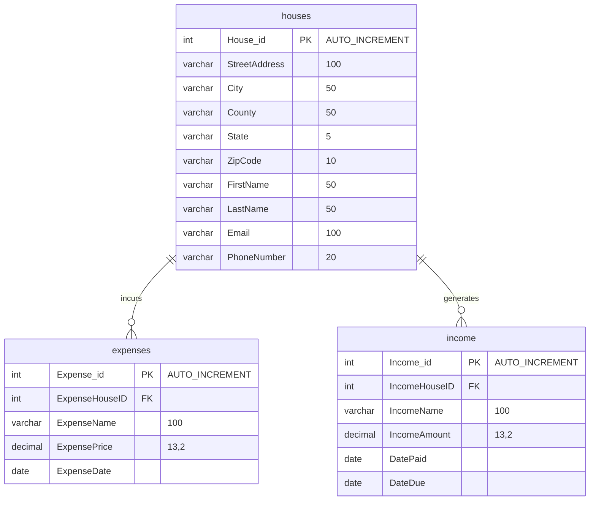

# Rental Company Database Manager

## Description

---

A desktop database management program built with JavaFX and Gradle to manage a house rental company's income, expenses.

> **Note:** Since I am learning as I go, I will be refactoring and updating the codebase as I learn new concepts and find ways to improve the program.

## Prerequisites & Dependencies

---

### Core Environment
* **JDK 17 or higher**
* **Gradle**

### Database
* **MySQL Server (v8.0 or higher)** 

### JavaFX Modules (v26.0.1)
* `javafx.controls`
* `javafx.fxml`

### External Libraries
* **MySQL Connector/J (v9.7.0)**
* **HikariCP (v7.0.2)**
* **SLF4J Simple (v2.0.18)**
* **BuildConfig Plugin (v6.0.9)**
* **JUnit 5 (v6.0.0 BOM)**

## 🛠️ Configuration

---

Initialize your database by running the following command in your database's directory while replacing the placeholders with your database's information.
```bash
mysql -u your_username -p your_database < schema.sql
```

Create a `gradle.properties` file in the root directory and paste the following in while replacing the placeholders with your database information.

```properties
url=jdbc:mysql://localhost:3306/your_database
username=your_username
password=your_password
```

> ⚠️ **Note:** The `gradle.properties` file should be included in `.gitignore`.

## 🗄️ Database Structure


## 🚀 Running the Program

---

```bash
./gradlew run
```